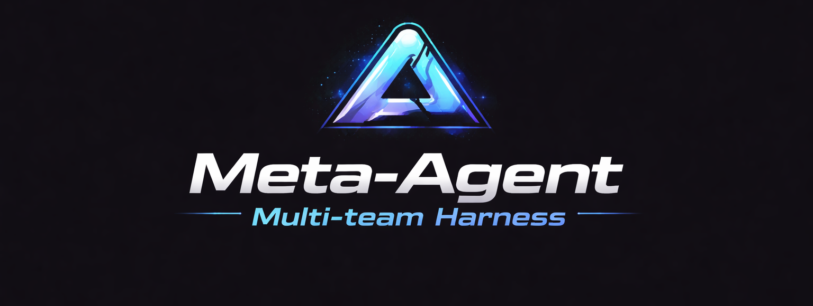

<p align="center">
  
</p>

[)](https://github.com/Hive-Hue/meta-agents-harness/actions/workflows/validate.yml)
[](https://github.com/Hive-Hue/meta-agents-harness/commits/development)
[](./LICENSE)

# Meta Agents Harness

**Meta Agents Harness** is a unified multi-agent control layer for **OpenCode**, **Claude Code**, **PI**, and **Hermes**.

Instead of maintaining separate operator flows, runtime shims, and team topologies for each runtime, this project exposes a **single command surface** — `mah` — and dispatches to the correct runtime automatically.

The `development` branch represents the **product-grade evolution path** of the project: stronger canonical configuration, layered validation, explainability, and a future adapter-based runtime architecture.

---

## Why this exists

Multi-agent teams often end up fragmented across runtime-specific repos and operator flows.

Meta Agents Harness solves that by providing:

- **expertise-aware routing** — agents matched by skill and capability, not just name
- **operational context memory** — the right docs fetched per task, per agent
- **session and lifecycle visibility** — see execution as it happens, resume or inspect any session
- **compounding loop** — successful runs improve future routing through governed expertise sync
- **one CLI surface** for multiple runtimes with runtime-aware dispatch
- **shared multi-team topology** (`orchestrator → leads → workers`)
- **AI-assisted bootstrap** as optional acceleration, not a requirement

Route the right agent, load the right context, show the work, compound over time.

---

## Getting Started

New to Meta Agents Harness? Get up and running quickly:

### Quick Bootstrap Examples

```bash
# Interactive mode (prompts for configuration)
npm run setup

# Non-interactive with defaults
mah init --yes

# Custom project details
mah init --yes --crew my-team --name "My Project" --description "Project description"

# Force overwrite existing config
mah init --yes --force
```

> `mah init` produces an expertise-aware topology — not just a config file. Each agent gets a capability profile that drives routing.

### Verify Your Setup

```bash
mah detect          # Check runtime detection
mah validate:config # Validate configuration
mah doctor          # Run diagnostics
```

📖 **For detailed bootstrap documentation, see [`docs/getting-started.md`](./docs/getting-started.md)**

---

## Current status of the `development` branch

This branch is where the project is being shaped into a more robust product layer.

Current focus areas include:

- making `meta-agents.yaml` the true canonical source of truth
- reducing drift between config and generated runtime artifacts
- improving validation and diagnostics
- preparing an adapter model for future runtime extensibility
- improving operator UX with explainability and safer sync flows
- unified session operations across all runtimes (list, resume, new, export, delete)

This branch is the right place to evaluate the **direction**, **architecture**, and **product positioning** of the project.

---

## Core product idea

Use one command surface:

```bash
mah <command>
```

And let the harness resolve:

- which runtime is available
- which executable or compatibility shim to use
- which crew is active
- how session flags should be normalized
- how runtime-specific artifacts are generated or validated

---

## Runtime detection model

Detection currently follows this priority:

1. forced runtime via `--runtime`, `-r`, `-f`, or `MAH_RUNTIME`
2. runtime marker directory in the repository (`.pi`, `.claude`, `.opencode`, `.hermes`)

If no runtime marker is present, detection returns `unknown` unless you force a runtime explicitly.

These defaults are internal to MAH. New `meta-agents.yaml` files no longer need a `runtime_detection` block unless you are overriding the standard behavior.

---

## Supported runtimes

Meta Agents Harness currently targets:

- **OpenCode**
- **Claude Code**
- **PI**
- **Hermes**

The repository ships runtime assets for all four runtimes, while presenting a single operator entrypoint.

Hermes support is deep but intentionally bounded — it strengthens the runtime portfolio without compromising MAH's runtime-agnostic product identity. See [`docs/hermes/runtime-support.md`](./docs/hermes/runtime-support.md) for details on what is supported and what remains intentionally out of scope.

### Plugin API for Runtimes (v0.5.0)

MAH supports **runtime plugins** — add new runtimes without touching core files.

```bash
mah plugins list                      # show loaded plugins
mah plugins validate ./path           # validate a plugin without installing
mah plugins install ./path           # install a plugin locally
mah plugins uninstall <name>         # remove an installed plugin
```

Installed plugins persist across MAH updates. See [`docs/plugin-api.md`](./docs/plugin-api.md) for the full plugin contract, manifest format, discovery mechanism, and CLI API.

Plugins can be wrapper-based or MAH-managed. In the MAH-managed model, MAH owns crew state and generated artifacts, and the plugin only maps that context into the runtime's direct CLI.

---

## Key concepts

### 1. Unified CLI

The main operator surface is `mah`.

Examples:

```bash
mah detect
mah explain
mah explain run --trace
mah doctor
mah init --runtime opencode --crew dev
mah init --yes --force --crew bootstrap-config
mah generate
mah plan
mah diff
mah sessions list
mah sessions list --runtime hermes --json
mah sessions resume pi:dev:abc123
mah sessions new --runtime hermes
mah sessions export pi:dev:abc123
mah sessions delete pi:dev:abc123 --yes
mah sessions new --runtime hermes --dry-run
mah graph --crew dev --json
mah graph --crew dev --mermaid
mah graph --crew dev --mermaid --mermaid-level group
mah graph --crew dev --mermaid --mermaid-level detailed
mah graph --crew dev --mermaid --mermaid-level detailed --mermaid-capabilities
mah demo dev
MAH_AUDIT=1 mah run --session-mode continue
mah run --session-mode none "quick task"
mah validate:runtime
mah validate:config
mah validate:sync
mah validate:all
mah validate
mah list:crews
mah use dev
mah clear
mah run
mah expertise recommend --task "fix auth middleware"  # route by capability
mah expertise sync                                    # strengthen routing from session outcomes
mah skills list                                       # list skills and assignments
mah skills inspect stitch-react-handoff               # inspect skill metadata
mah skills add stitch-react-handoff --agent frontend-dev
mah context find --agent worker-1 --task "fix auth"   # fetch operational memory
mah context propose --from-session pi:dev:abc123      # governed learning
mah sessions status                                   # see what's running
```

### 2. Canonical configuration

The project uses `meta-agents.yaml` as the canonical multi-runtime configuration index.

This config is used to define:

- runtime detection behavior (internal defaults)
- runtime-specific config roots and optional runtime entrypoint overrides
- model catalog and fallbacks
- skill references resolved by convention
- domain profiles
- multi-team crew topology
- runtime overrides

### 3. Generated runtime artifacts

From the canonical config, the project materializes runtime-specific files under:

- `.pi/`
- `.claude/`
- `.opencode/`
- `.hermes/`

This preserves runtime-native structures while reducing duplicated authoring effort.

### 4. Multi-team operating model

The common abstraction is:

- **orchestrator**
- **team leads**
- **workers**

This structure is translated into each runtime's expected configuration model.

### 5. Hermes runtime support

Hermes is integrated as a first-class runtime through MAH's adapter model.

Key characteristics:

- **Adapter-driven**: Hermes uses the same `createAdapter()` factory pattern as PI, Claude, and OpenCode
- **Bounded integration**: Support is deep enough to be useful, but does not turn MAH into a Hermes fork
- **Honest limitations**: Commands or semantics that cannot be cleanly mapped fail with clear, explainable errors
- **Selective absorption**: Selected Hermes-compatible patterns (persistence metadata, backend hints, capability flags) are adopted where they strengthen MAH's orchestration layer

Quick start with Hermes:

```bash
npm run sync:meta
mah use dev
mah --runtime hermes detect
mah --runtime hermes doctor
mah --runtime hermes explain run --trace
mah --runtime hermes run
```

On `mah --runtime hermes run`, the MAH core now bootstraps the active crew's orchestrator context and then continues the interactive Hermes session through the native `hermes` CLI.

See [`docs/hermes/`](./docs/hermes/) for the complete Hermes integration guide.

### 6. Expertise model foundation

In `v0.7.0`, the expertise model is treated as an operational foundation concept:

- canonical catalog loading by expertise id from the workspace-local `.mah/expertise/catalog`
- evidence-backed routing and explainability
- validation, lifecycle, export/import, and governance boundaries
- runtime evidence storage that can be redirected with `MAH_EXPERTISE_EVIDENCE_ROOT`

`mah generate`, `mah sync`, and `mah expertise list` do not depend on a cloned MAH repo. The global install prepares `~/.mah/` with the canonical skills, extensions, plugins, and themes, while each workspace gets its own generated `.mah/` expertise catalog, cache, and evidence tree as needed.

The workspace-local `.mah/expertise/evidence` directory is intentionally empty except for `.gitkeep`; real evidence should come from live tasks and test runs should use a temp root.

See: `docs/expertise-model-foundation.md`

### 7. Context Manager

The Context Manager provides bounded operational memory fetched per task:

- **per-agent, per-task retrieval** — `mah context find --agent <agent> --task "<task>"`
- **governed proposals** — `mah context propose --from-session <ref>` creates a draft for human review
- **no auto-promotion** — every context entry is curated before it enters the operational corpus
- **runtime-agnostic** — `.md` and `.qmd` sources, no vector DB dependency

See: `docs/context-manager.md`

---

## Installation

### Quick Start

Clone and install dependencies:

```bash
git clone https://github.com/Hive-Hue/meta-agents-harness.git
cd meta-agents-harness
npm run setup
```

### Bootstrap / Initial Setup

The first time you run `npm run setup`, MAH automatically creates a `meta-agents.yaml` configuration file if one doesn't exist.

#### Interactive Mode (default)

When running in an interactive terminal, MAH prompts for basic configuration:

```bash
npm run setup
```

You'll be asked for:
1. Bootstrap mode: `1` (logical defaults) or `2` (AI-assisted - requires API key)
2. Project name
3. Project description  
4. Primary crew ID
5. Crew mission

#### Non-Interactive Mode

In CI/CD or non-TTY environments, MAH uses logical defaults automatically

```bash
npm run setup  # Runs with defaults
```

#### Manual Bootstrap

You can also run the bootstrap command directly:

```bash
npm run bootstrap:meta
```

Or use the `mah init` command for more control:

```bash
# Create with defaults
mah init --yes

# Force overwrite existing config
mah init --yes --force

# Specify project details
mah init --yes --crew my-team --name "My Project" --description "Project description"

# Interactive mode (prompts for input)
mah init
```

#### Environment Variables

You can override defaults via environment variables:

```bash
MAH_INIT_NAME="my-project" mah init --yes
MAH_INIT_DESCRIPTION="Custom description" mah init --yes
MAH_INIT_CREW="custom-crew" mah init --yes
```

### Optional Local Environment Setup

```bash
cp .env.sample .env
```

For detailed onboarding documentation, see [`docs/onboarding.md`](./docs/onboarding.md).

---

## MCP configuration

The repository uses two MCP-related files:

- `.mcp.example.json` — tracked repository template
- `.mcp.json` — local active configuration (gitignored)

Recommended flow:

```bash
cp .mcp.example.json .mcp.json
```

Then adjust local values and secrets as needed.

---

## Running the CLI

You can use the CLI locally:

```bash
node bin/mah --help
```

Or install it globally:

```bash
npm run install:global
```

This prepares `~/.mah/` with the default MAH assets. MAH prefers that global overlay first, then complements it with any local repo assets that exist:

- `skills/`
- `extensions/`
- `mah-plugins/`
- `scripts/`

Then:

```bash
mah --help
```

You can also invoke the package name directly after a global install:

```bash
meta-agents-harness --help
```

---

## Common commands

### Show help

```bash
mah --help
```

### Detect runtime

```bash
mah detect
```

### Run diagnostics

```bash
mah doctor
mah check:runtime
mah validate:runtime
mah validate:config
mah validate:sync
mah validate:all
mah validate
mah explain detect
mah explain run --trace
```

### Crew operations

```bash
mah list:crews
mah use <crew>
mah clear
```

### Interactive runtime execution

```bash
mah run
```

### Force runtime explicitly

```bash
mah --runtime opencode validate
mah --runtime claude check:runtime
mah --runtime pi run -c
mah use dev
mah --runtime hermes detect
mah --runtime hermes doctor
mah --runtime hermes run
```

---

## Unified session controls

The CLI normalizes session-related controls across runtimes.

Examples:

```bash
mah run --session-mode new
mah run --session-mode continue
mah run --session-mode none             # ephemeral (no session persistence)
mah run --session-id 11111111-1111-1111-1111-111111111111
mah run --session-root .pi/crew/dev/sessions
mah run --session-mirror
```

### Session modes

| Mode | pi | claude | opencode | hermes |
|------|----|--------|----------|--------|
| `new` | `--new-session` | — | — | `--new-session` |
| `continue` | `-c` | `--continue` | `-c` | `-c` |
| `none` | `--no-session` | `--print --no-session-persistence` | Not supported (warning) | Not supported (warning) |

When `--session-mode none` is set, `--session-id`, `--session-root`, and `--session-mirror` are ignored with warnings.

These are translated to runtime-native behavior internally.

For Hermes specifically:

- `--session-mode continue` maps to Hermes resume/continue semantics
- `--session-id` is bridged by the MAH core to Hermes resume arguments
- `--session-root` is captured as MAH session metadata, but Hermes still uses its own global session store/layout
- `--session-mirror` is ignored

---

## Canonical config and examples

The repository includes:

- [`meta-agents.yaml`](./meta-agents.yaml)
- [`examples/meta-agents.yaml.example`](./examples/meta-agents.yaml.example)
- [`examples/crew-dev.complete.example.yaml`](./examples/crew-dev.complete.example.yaml)
- [`examples/crew-marketing.complete.example.yaml`](./examples/crew-marketing.complete.example.yaml)

Use these files to understand and author crew topology, model mapping, agent skill refs, and runtime-specific overrides.

Skill paths are resolved by convention: a skill ref like `context_memory` maps to `skills/context-memory/SKILL.md` internally, and `context_memory` is applied as a default MAH skill without needing any catalog skill map.

---

## Sync and drift detection

Generate runtime artifacts from canonical config:

```bash
mah generate

# equivalent npm shortcut
npm run generate:meta

# legacy direct sync entrypoint
npm run sync:meta
```

Check drift without writing files:

```bash
npm run check:meta-sync
```

This is an important part of keeping runtime artifacts aligned with the source configuration.

---

## Runtime assets

The repository currently contains runtime-specific assets such as:

- `.opencode/` — OpenCode harness topology and scripts
- `.claude/` — Claude runtime assets and crew structure
- `.pi/` — PI runtime assets and crew structure
- `.hermes/` — Hermes runtime configuration and crew structure
- `extensions/` — PI runtime extensions and entrypoints

The purpose of the unified CLI is not to remove those assets, but to make them easier to manage from a single operational layer.

---

## Product direction for this branch

The `development` branch is focused on turning the project into a more mature platform.

### Planned evolution areas

#### Canonical config hardening
- formal config schema
- explicit config versioning
- stronger validation boundaries
- reduced duplication between YAML and dispatcher logic

#### Validation model
- split validation by concern:
  - config
  - runtime
  - sync
  - full validation
- semantics and ownership are defined in `docs/validate-semantics.md`

#### Operator UX
- improved diagnostics
- explainability for runtime resolution
- preview-oriented checks of generated changes before sync (`plan` / `diff`)
- stricter handling of ambiguous runtime markers

#### Platform capabilities
- initial unified session registry
- initial provenance and execution audit trails
- initial execution graph visibility
- runtime adapter foundation (still evolving, not a final external plugin API)
- capability status and policy details are documented in `docs/platform-capabilities.md`

This branch is therefore useful both as a working branch and as a public-facing signal of the product roadmap.

Current maturity note:

- diagnostics include expanded structured outputs, but output schemas are still being normalized
- `plan` and `diff` are currently lightweight operator workflows around sync reporting
- `sessions`, `provenance`, `graph`, and `demo` remain initial support in this release line

---

## Architectural direction

The runtime model is converging on adapters and plugins that integrate with the MAH core.

Canonical boundary in this repository:

- `meta-agents.yaml` is the source of truth for crews/config content
- `runtime-adapters.mjs` is the source of truth for runtime operational behavior

Boundary details are documented in `docs/runtime-boundary.md`.

A runtime should be represented as an explicit contract rather than implicit command branching scattered through the dispatcher. MAH now supports two integration styles:

- MAH-managed runtimes, where MAH manages crew state, generated tree lookup, and run preparation before calling the runtime CLI directly
- compatibility-shim runtimes, where a repo-local wrapper still bridges missing runtime primitives

Illustrative direction:

```ts
interface RuntimeAdapter {
  name: string
  detect(context: DetectContext): DetectResult
  validate(level: "runtime" | "config" | "sync"): ValidationResult
  run(args: RunArgs): RunResult
  useCrew(crew: string): CommandResult
  clearCrew(): CommandResult
  capabilities(): CapabilityMatrix
}
```

`plugins/runtime-kilo` is the reference plugin for the MAH-managed model in this branch. The bundled runtime plugins (`pi`, `claude`, `opencode`, `hermes`) follow the same orchestration path, with wrappers kept only as an optional compatibility escape hatch for future plugins that may need them.

---

## Why this branch may matter publicly

If you are evaluating the project from the outside, the `development` branch is where you can understand:

- how the project intends to evolve from wrapper to orchestration layer
- how canonical config and runtime parity are being shaped
- what product-grade features are being prioritized
- how future extensibility and observability may work

It is the best branch to inspect for **roadmap**, **direction**, and **product architecture**.

---

## Troubleshooting

### Runtime could not be detected

Possible causes:

- the repository has no `.pi`, `.claude`, `.opencode`, or `.hermes` marker
- no relevant runtime plugin is present
- no explicit `--runtime` was passed

Try:

```bash
mah detect
mah --runtime opencode detect
```

### Executable not found for runtime

Try:

- running `npm run setup`
- verifying runtime plugin presence and optional wrapper availability
- forcing a known runtime explicitly

### MCP configuration missing

If `.mcp.json` is missing:

```bash
cp .mcp.example.json .mcp.json
```

### Codex MCP `mah`

MAH-managed Codex sessions inject the local `mah` MCP server automatically at launch time. No global `codex mcp add` step is required for:

```bash
mah --runtime codex use --crew dev
mah --runtime codex run
```

Inside the Codex session, the supported MAH tools are:

- `mah_get_active_context`
- `mah_list_agents`
- `mah_delegate_agent`

Optional manual installation is still available if you want the same server outside MAH-managed sessions:

```bash
codex mcp add mah -- /home/alysson/.nvm/versions/node/v22.19.0/bin/node /home/alysson/Github/meta-agents-harness/plugins/mah/mcp/server.mjs
```

If you want Codex to load a shared `.env` before it starts, use the repo wrapper:

```bash
MAH_CODEX_ENV_FILE=/home/alysson/Github/meta-agents-harness/.env \
  /home/alysson/Github/meta-agents-harness/scripts/codex-with-env.sh
```

### `mah` command not available

Use the local entrypoint:

```bash
node bin/mah --help
```

Or install globally:

```bash
npm run install:global
```

That prepares `~/.mah/` with the default MAH assets and makes the global `mah` entrypoint available. MAH prefers the global overlay first and uses local repo assets only as a complement when a global asset is absent.

---

## Local development

Install dependencies:

```bash
npm run setup
```

Run smoke tests:

```bash
npm run test:smoke
```

Validate canonical sync:

```bash
npm run check:meta-sync
```

---

## Related positioning

Meta Agents Harness can be viewed as the unification layer above runtime-specific harness repos.

Instead of replacing runtime-native behavior, it provides:

- shared operator commands
- canonical team definition
- consistent validation direction
- structured migration path

That makes it useful both for greenfield setups and for teams already operating per-runtime harnesses.

---

## License

Dual licensing:

- AGPLv3 open-source license
- Commercial proprietary license

See:

- [LICENSE](./LICENSE)
- [AGPL-3.0.md](./AGPL-3.0.md)
- [COMMERCIAL-LICENSE.md](./COMMERCIAL-LICENSE.md)
